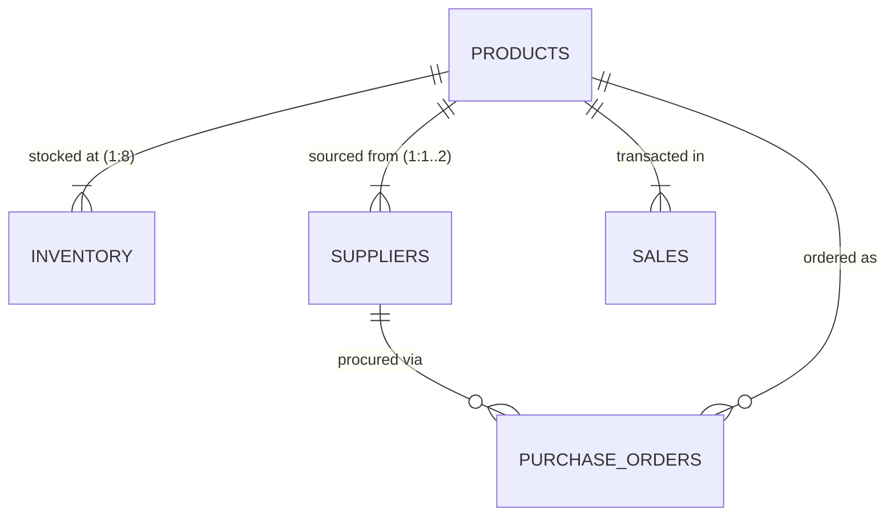

# Exploratory Data Analysis (EDA) Report: Kaveri Spares & Hydraulics

**Snapshot Date:** Morning of 2026-11-16 (Stock)  
**Sales Window:** 2026-09-17 to 2026-11-15 (60 calendar days)  
**Geography:** North Karnataka (6 retail stores: Bagalkot, Belgaum, Bijapur, Dharwad, Gokak, Hubli; 2 central distribution hubs: Belgaum WH, Hubli WH)

---

## 1. Executive Summary & Dataset Architecture

The dataset comprises **5 relational CSV files** tracking inventory levels, product catalog, supplier terms, purchase orders, and point-of-sale transactions. 

### Dataset Architecture & Completeness Matrix

| File Name | Records | Columns | Primary Key / Grain | Missing / Null Values | Exact Duplicates | Integrity / Orphan Status |
| :--- | :---: | :--- | :--- | :---: | :---: | :--- |
| [`products.csv`](file:///Users/likhithsshetty/Downloads/01_spare_parts/products.csv) | 126 | `sku`, `product_name`, `machine_model`, `category` | `sku` | 0 (0.0%) | 0 | 100% matched across all files |
| [`inventory.csv`](file:///Users/likhithsshetty/Downloads/01_spare_parts/inventory.csv) | 1,008 | `sku`, `location`, `stock` | `(sku, location)` | 0 (0.0%) | 0 | Full Cartesian Grid (126 SKUs × 8 Locs) |
| [`suppliers.csv`](file:///Users/likhithsshetty/Downloads/01_spare_parts/suppliers.csv) | 205 | `supplier`, `sku`, `price`, `lead_time_days`, `moq` | `(supplier, sku)` | 0 (0.0%) | 0 | All SKUs belong to product catalog |
| [`purchase_orders.csv`](file:///Users/likhithsshetty/Downloads/01_spare_parts/purchase_orders.csv) | 43 | `po`, `supplier`, `sku`, `qty`, `expected_date`, `status` | `po` | 0 (0.0%) | 0 | All `(supplier, sku)` pairs valid |
| [`sales.csv`](file:///Users/likhithsshetty/Downloads/01_spare_parts/sales.csv) | 12,777 | `date`, `sku`, `location`, `qty_sold` | Transaction record | 0 (0.0%) | 0 | Retail stores only; 0 WH sales |



---

## 2. Statistical Profiles & Outlier Analysis

Statistical outlier detection was performed using the **Interquartile Range (IQR) rule** ($Q_1 - 1.5 \times \text{IQR}$ to $Q_3 + 1.5 \times \text{IQR}$) and **Extreme Outlier boundary** ($Q_3 + 3.0 \times \text{IQR}$), alongside standard Z-scores.

### Statistical Summary Table

| Metric / Variable | Count ($N$) | Min | Q1 (25%) | Median | Mean | Q3 (75%) | Max | Std Dev | IQR | Upper Fence | Extreme Threshold | Outliers ($> Q_3 + 1.5 \text{IQR}$) |
| :--- | :---: | :---: | :---: | :---: | :---: | :---: | :---: | :---: | :---: | :---: | :---: | :---: |
| **Inventory Stock** | 1,008 | 0 | 4.0 | 14.0 | 21.26 | 32.0 | 180 | 21.39 | 28.0 | 74.0 | 116.0 | 23 (1 extreme) |
| **Supplier Price (₹)** | 205 | 186.0 | 1,049.0 | 1,979.0 | 2,148.88 | 3,146.0 | 4,869.0 | 1,316.37 | 2,097.0 | 6,291.5 | 9,437.0 | 0 |
| **Lead Time (days)** | 205 | 3.0 | 4.0 | 5.0 | 5.85 | 7.0 | 21.0 | 2.59 | 3.0 | 11.5 | 16.0 | 1 (1 extreme) |
| **Supplier MOQ** | 205 | 5.0 | 10.0 | 20.0 | 15.76 | 20.0 | 200.0 | 15.01 | 10.0 | 35.0 | 50.0 | 1 (1 extreme) |
| **PO Quantity** | 43 | 10.0 | 25.0 | 30.0 | 36.35 | 48.0 | 60.0 | 13.53 | 23.0 | 82.5 | 117.0 | 0 |
| **Sales Qty / Tx** | 12,777 | 1 | 1.0 | 1.0 | 1.52 | 2.0 | 8 | 0.86 | 1.0 | 3.5 | 5.0 | 479 (37 extreme) |
| **Daily Sales (Total Units)** | 60 | 288 | 312.0 | 324.0 | 324.4 | 338.5 | 371 | 18.2 | 26.5 | 378.25 | 418.0 | 0 |

---

## 3. Flagged Outliers & Supply Chain Anomalies

### 🚨 Critical Anomaly 1: Overdue Open Purchase Order
> [!WARNING]
> **Purchase Order `PO-4471` is past its delivery date and remains open.**
> - **Supplier:** Tungabhadra Motors
> - **SKU:** `SEL-3310` (Oil Seal Kit for Mahindra 575 DI)
> - **Quantity:** 60 units
> - **Expected Delivery Date:** `2026-11-10`
> - **Data Snapshot Date:** Morning of `2026-11-16` (Overdue by 6 days)
> - **Current Status:** `Open`
> - All other 12 past-dated POs are properly marked `Received`. All other 22 Open POs have expected dates between Nov 17 and Nov 27.

### 🚨 Critical Anomaly 2: Extreme Procurement Terms for SKU `CLT-6120`
> [!CAUTION]
> **Extreme Statistical Outlier on Lead Time and MOQ for `CLT-6120`.**
> - **SKU:** `CLT-6120` (Pressure Plate for Kubota MU4501)
> - **Supplier:** Kaveri Bearings Co (Sole supplier; single-source risk)
> - **Lead Time:** **21 days** (Sample median = 5 days, max of all other suppliers = 10 days, $Z = 5.85$)
> - **Minimum Order Quantity (MOQ):** **200 units** (Sample median = 20 units, max of all other items = 25 units, $Z = 12.27$)
> - **Warehouse Inventory:** **0 units** in Belgaum WH, **0 units** in Hubli WH
> - **Retail Store Inventory:** Gokak store has only **4 units** left!
> - **Current POs:** **0 active purchase orders**! If Gokak runs out, lead time is 3 weeks and minimum capital required is ₹680,000 (200 units × ₹3,400).

### 🚨 Critical Anomaly 3: System-Wide Depletion / Dual Warehouse Stockouts
Three high-demand SKUs have **zero inventory in both central warehouses** (`Belgaum WH` and `Hubli WH`):

| SKU | Product Description | Daily Demand Rate | Store Stock Remaining | Central WH Stock | Active POs | Days of Supply (Store) | Immediate Action Required |
| :--- | :--- | :---: | :---: | :---: | :---: | :---: | :--- |
| **`SEL-3310`** | Oil Seal Kit (Mahindra 575 DI) | 5.37 units/day | 105 units | **0 units** | `PO-4471` (60 units, OVERDUE) | **19.6 days** | Expedite PO-4471 with Tungabhadra Motors |
| **`FLT-1021`** | Hydraulic Filter (JCB 3DX) | 5.33 units/day | 107 units | **0 units** | **0 POs** | **20.1 days** | Issue emergency PO immediately |
| **`CLT-6120`** | Pressure Plate (Kubota MU4501) | 1.37 units/day | 114 units | **0 units** | **0 POs** | **83.2 days** (Gokak: 3 days) | Rebalance inventory from Hubli/Belgaum to Gokak |

### 🚨 Critical Anomaly 4: Massive Inventory Hoarding / Capital Lockup (`BRG-2207`)
> [!IMPORTANT]
> **Extreme Location Outlier: Bijapur store holding 180 units of `BRG-2207`.**
> - **SKU:** `BRG-2207` (Axle Bearing for Escorts Farmtrac 60)
> - **Supplier Price:** ₹3,871 - ₹4,139 per unit (Average ₹4,005)
> - **Stock in Bijapur:** **180 units** (Valued at ₹720,900)
> - **60-Day Sales in Bijapur:** Only **6 units** (0.1 units/day)
> - **Days of Inventory in Bijapur:** **1,800 days (~5 years of inventory)**
> - Meanwhile, Gokak store has **0 units**, Belgaum store has **1 unit**, and Bagalkot has **1 unit**.

### 🚨 Critical Anomaly 5: Non-Standard SKU Numbering Pattern
121 of 126 products adhere to a strict `XXX-10YY` convention (e.g. `BLT-1003`, `HYD-1024`). Exactly **5 products** violate this scheme:

| Irregular SKU | Product Name | Category | Machine Model | Regularity Discrepancy & Behavior |
| :--- | :--- | :--- | :--- | :--- |
| **`BLT-4105`** | Fan Belt | Belts | Swaraj 744 FE | 4000-series ID; fast mover (293 units sold) |
| **`BRG-2207`** | Axle Bearing | Bearings | Escorts Farmtrac 60 | 2000-series ID; extreme stock hoarding in Bijapur (180 units) |
| **`CLT-6120`** | Pressure Plate | Clutch Parts | Kubota MU4501 | 6000-series ID; extreme MOQ (200) & lead time (21d) |
| **`PMP-5012`** | Water Pump | Pumps | Sonalika DI 750 | 5000-series ID; 2nd highest selling SKU company-wide (397 units) |
| **`SEL-3310`** | Oil Seal Kit | Seals & Gaskets | Mahindra 575 DI | 3000-series ID; overdue PO-4471 and 0 warehouse stock |

### 🚨 Critical Anomaly 6: Purchase Order ID Sequence Skips
`purchase_orders.csv` numbers contain conspicuous numbering gaps:
- Sequence 4401–4444 has 3 missing IDs: **`PO-4413`**, **`PO-4417`**, **`PO-4438`**.
- Sequence then jumps from 4444 directly to **`PO-4471`** (the overdue order for `SEL-3310`) and **`PO-4488`** (order for `PMP-5012`), skipping **45 intermediate PO IDs**.

---

## 4. Deep-Dive Domain Analysis

### A. Inventory Distribution & Financial Capital Valuation
Total company inventory stands at **21,436 units** with an estimated inventory capital value of **₹46,636,841 (₹4.66 Crore)**.

```
Distribution of Inventory Value:
Hubli WH    : ₹11,802,881 (25.3%) █████████████
Belgaum WH  : ₹11,373,222 (24.4%) ████████████
Bijapur     :  ₹4,623,797 ( 9.9%) █████
Bagalkot    :  ₹4,421,705 ( 9.5%) █████
Dharwad     :  ₹3,820,231 ( 8.2%) ████
Belgaum     :  ₹3,724,146 ( 8.0%) ████
Gokak       :  ₹3,488,552 ( 7.5%) ████
Hubli       :  ₹3,382,304 ( 7.3%) ████
```

- Central Warehouses store **50.7%** of physical units and **49.7%** of capital value.
- Retail stores store **49.3%** of units and **50.3%** of capital value.

### B. Store-Level Dead Stock & Stockouts
- **Dormant Stock:** **143 store-SKU pairings** currently hold stock but had **zero sales** across the entire 60-day window.
- **Stockouts:** **4 store-SKU pairings** have reached 0 stock despite active customer demand (`BLT-1016` in Dharwad, `HYD-1038` in Hubli, `HYD-1051` in Belgaum, and `SEL-1098` in Gokak).

### C. Sales Dynamics & High-Transaction Outliers
- Total sales across 60 days: **19,465 units** across **12,777 transactions**.
- Day-of-week pattern: Very balanced across the week (Monday–Wednesday average ~2,600 units; Thursday–Sunday average ~2,900 units).
- **Transaction Size Outliers:**
  - 87.3% of transactions are for 1 or 2 units.
  - Exactly 37 transactions were for $\ge 6$ units (max: 8 units for `HYD-1024` on 2026-10-26 in Bagalkot).
- **Top 2 Sales Velocity Outliers:**
  1. `HYD-1024` (High-Pressure Hose, JCB 3DX): 452 units sold (7.53 units/day).
  2. `PMP-5012` (Water Pump, Sonalika DI 750): 397 units sold (6.62 units/day).

---

## 5. Strategic Recommendations

1. **Immediate Supplier Escalation:** Follow up on overdue order `PO-4471` (Tungabhadra Motors) to protect against stockout of `SEL-3310`.
2. **Issue Purchase Order for `FLT-1021`:** Warehouses have 0 units, and store stock will be exhausted in ~20 days.
3. **Internal Stock Rebalancing for `BRG-2207`:** Transfer 100+ units of `BRG-2207` from Bijapur back to Belgaum WH or understocked stores (Gokak, Belgaum, Bagalkot) to free up ₹400,000+ of working capital.
4. **Renegotiate or Audit `CLT-6120`:** Investigate whether Kaveri Bearings Co's 21-day lead time and 200 MOQ are contractual data-entry errors or genuine OEM restrictions.
